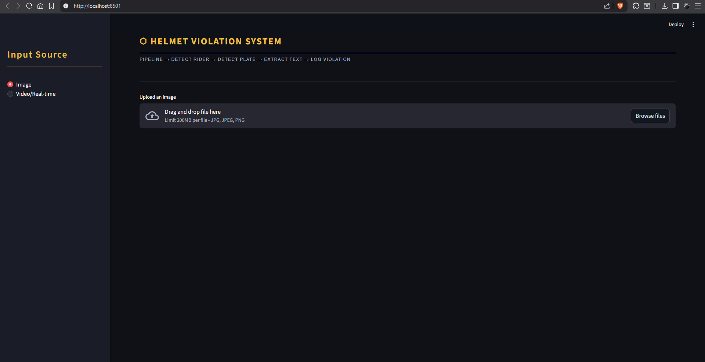

# ⬡ Helmet Violation Detection System

An AI-powered traffic violation detection system that identifies motorcycle riders without helmets, extracts their license plate numbers, and automatically logs violations — built using YOLOv11, YOLOv8, and PaddleOCR.

---

## 🎯 What It Does

- Detects riders **with** and **without** helmets using a custom YOLOv11 model
- Detects and reads **license plates** using a custom YOLOv8 model + PaddleOCR
- Logs all violations with **rider image**, **plate image**, **plate number**, and **timestamp**
- Works on both **images** and **videos**
- Saves a persistent violation log to CSV across sessions

---

## 📸 Screenshots

### Home Screen


### Image Mode — Detection Results
)

### Image Mode — Violation Logged


### Video Mode — Live Processing


### Video Mode — Violation Logged


---

## 🖥️ System Requirements

| Requirement | Minimum |
|---|---|
| OS | Windows 10 / 11 |
| Python | 3.9, 3.10, or 3.11 |
| RAM | 8 GB |
| GPU | Optional (NVIDIA recommended for faster video processing) |
| Storage | ~3 GB (for models + packages) |

---

## 📦 Installation & Setup

### Step 1 — Install Python

Download and install Python 3.11 from:
👉 https://www.python.org/downloads/

> ⚠️ During installation, **check the box that says "Add Python to PATH"**

---

### Step 2 — Download This Project

Click the green **Code** button on this GitHub page → **Download ZIP**

Extract the ZIP to a folder on your computer (e.g. `C:\HelmetDetection`)

---

### Step 3 — Model Files

Both model files are included in this repository:

| File | Description |
|---|---|
| `yolo_helmet_model.pt` | Helmet detection model |
| `plate_model.pt` | License plate detection model |

They are already in the correct location — no extra setup needed.

---

### Step 4 — Install Required Packages (First Time Only)

Double-click **`install.bat`**

This will:
- Detect whether you have an NVIDIA / AMD / Intel GPU
- Install all required Python packages automatically
- Takes about 5–10 minutes depending on your internet speed

> ✅ Only do this once. Skip this step if you already have all packages installed.

---

### Step 5 — Run the App

Double-click **`run.bat`**

This will:
- Check that everything is installed correctly
- Check that model files are present
- Launch the app in your browser at `http://localhost:8501`

> If your browser doesn't open automatically, go to: **http://localhost:8501**

---

## 🚀 How to Use

### Image Mode
1. Select **Image** from the sidebar
2. Upload a `.jpg`, `.jpeg`, or `.png` file
3. The system will show three panels:
   - **Input image** — original upload
   - **Helmet detection** — rider and helmet/no-helmet boxes
   - **License plate detection** — detected plate boxes
4. Violations are automatically logged in the table below

### Video Mode
1. Select **Video/Real-time** from the sidebar
2. Upload a `.mp4`, `.avi`, `.mov`, or `.mkv` file
3. Click **▶ Start** to begin processing
4. Click **⏹ Stop** at any time — all violations found so far are saved
5. The last processed frame and full violation log appear after processing

---

## 📁 Project Structure

```
HelmetDetection/
│
├── app.py                  # Main Streamlit application
├── install.bat             # Run ONCE to install all packages
├── run.bat                 # Double-click to launch the app
├── requirements.txt        # Python package list
├── yolo_helmet_model.pt    # Helmet detection model (YOLOv11)
├── plate_model.pt          # License plate detection model (YOLOv8)
│
└── Violations/             # Auto-created when the app runs
    ├── violations_log.csv  # Full violation history
    ├── rider_*.jpg         # Saved rider face crops
    └── plate_*.jpg         # Saved plate image crops
```

---

## 🛠️ Manual Installation (if install.bat fails)

Open **Command Prompt** and run these one by one:

```bash
pip install streamlit
pip install opencv-python
pip install "numpy>=1.24,<2.0"
pip install pandas Pillow
pip install ultralytics --upgrade
pip install paddlepaddle==2.6.2
pip install paddleocr==2.7.3
```

Then launch the app:
```bash
streamlit run app.py
```

---

## 🔧 How It Works

### Detection Pipeline

```
Input (Image / Video)
        │
        ▼
┌─────────────────────────┐
│     YOLOv11 Medium      │  Helmet Detection Model
│  Detects:               │
│  • Rider                │
│  • Helmet               │
│  • No_Helmet            │
└──────────┬──────────────┘
           │ No_Helmet linked to a Rider?
           ▼
┌─────────────────────────┐
│     YOLOv8 Nano         │  License Plate Detection Model
│  Finds nearest plate    │
│  to the violating rider │
└──────────┬──────────────┘
           │
           ▼
┌─────────────────────────┐
│       PaddleOCR         │  Text Extraction
│  • 3x upscale           │
│  • Read all text lines  │
│  • Validate Indian      │
│    state code + format  │
└──────────┬──────────────┘
           │
           ▼
┌─────────────────────────┐
│    Violation Logger     │
│  • Save rider crop      │
│  • Save plate crop      │
│  • Save plate number    │
│  • Append to CSV log    │
└─────────────────────────┘
```

### Smart Detection Features

- **Rider-Helmet Linking** — No_Helmet is only flagged if it spatially overlaps with a Rider box, eliminating false positives like pedestrians or traffic police
- **Nearest Plate Assignment** — Each rider is assigned the closest license plate to their bounding box, preventing wrong plate assignment when multiple bikes are in frame
- **Duplicate Prevention** — Same person is never logged twice using plate text tracking and position zone tracking across frames
- **Best Frame Selection (Video)** — Waits across multiple frames and picks the highest confidence plate reading before logging
- **Indian Plate Validation** — OCR output is corrected for common misreads and validated against all 36 official Indian state/UT codes and the standard format (`XX00XX0000`)

---

## 🤖 Model Details

### Helmet Detection — `yolo_helmet_model.pt`

| Property | Details |
|---|---|
| Architecture | YOLOv11 Medium |
| Base Model | `yolo11m.pt` (pretrained on COCO) |
| Classes | `Motorcycle`, `Rider`, `Helmet`, `No_Helmet` |
| Input Size | 640 × 640 px |
| Epochs | 100 |
| Training Platform | Google Colab — NVIDIA T4 GPU |
| Framework | Ultralytics YOLOv11 + PyTorch |
| Dataset | Custom annotated Indian traffic images |

### License Plate Detection — `plate_model.pt`

| Property | Details |
|---|---|
| Architecture | YOLOv8 Nano |
| Base Model | `yolov8n.pt` (pretrained on COCO) |
| Classes | `License_Plate` |
| Input Size | 640 × 640 px |
| Epochs | 50 |
| Training Platform | Google Colab — NVIDIA T4 GPU |
| Framework | Ultralytics YOLOv8 + PyTorch |
| Datasets | Indian Car Bike Number Plate v2 + Large License Plate Detection + ANPR Dataset (merged & cleaned) |

### OCR — PaddleOCR 2.7.3

| Property | Details |
|---|---|
| Backend | PaddlePaddle 2.6.2 |
| Detection Model | DB (Differentiable Binarization) |
| Recognition Model | CRNN |
| Preprocessing | 3× bicubic upscale before inference |
| Post-processing | State code correction + regex format validation |
| Language | English |

---

## 🛠️ Tech Stack

| Component | Technology |
|---|---|
| UI | Streamlit |
| Helmet Detection | YOLOv11 Medium — custom trained |
| Plate Detection | YOLOv8 Nano — custom trained |
| OCR | PaddleOCR 2.7.3 |
| Deep Learning Framework | PyTorch (via Ultralytics) |
| Image Processing | OpenCV |
| Data Handling | Pandas, NumPy |
| Training Platform | Google Colab (NVIDIA T4 GPU) |

---

## ⚠️ Known Limitations

- **Blurry or distant plates** — OCR accuracy drops on small or blurry plates; LPR cameras would solve this
- **Angled plates** — Plates tilted more than ~30° may be misread or partially extracted
- **Overlapping riders** — When multiple riders are very close, plate assignment may occasionally be incorrect
- **Low light** — Detection confidence drops in poor lighting or night-time footage without infrared cameras
- **Non-standard plates** — Fancy fonts, stickers, or damaged plates may not be read correctly

---

## 🔮 Future Improvements

### Accuracy Improvements
- Train a dedicated Indian license plate OCR model instead of general-purpose PaddleOCR
- Train the plate model specifically on bike plates (currently trained on mixed car/bike data)
- Integrate LPR cameras with infrared sensors for accurate plate reading at high speeds, long distances, and in low light
- Add plate tilt correction (deskewing) before OCR for angled plates

### Feature Additions
- Real-time CCTV/webcam stream support via RTSP instead of uploaded files only
- RTO e-Challan integration — query VAHAN API for the owner's registered mobile number and auto-send a digital challan via SMS with a UPI payment link, completely eliminating paperwork
- Dashboard with violation statistics — graphs by time, location, and plate frequency
- Multiple camera support for full intersection monitoring
- Automatic PDF report generation with rider photo, plate image, timestamp, and location

### Technical Improvements
- TensorRT optimization for YOLO models — 2-3x faster inference on NVIDIA GPUs enabling true real-time processing
- ByteTrack/SORT integration for proper multi-object tracking instead of the current center-X approach
- SQLite database instead of CSV for better querying, filtering, and scalability

---

## 🗒️ Notes

- First run takes longer as PaddleOCR downloads its internal models (~500MB) — this is a one-time download
- NVIDIA GPU is automatically used if available — no manual setup needed
- The `Violations/` folder is created automatically in the same directory as `app.py`
- Violation log (`violations_log.csv`) persists across sessions and keeps growing

---
